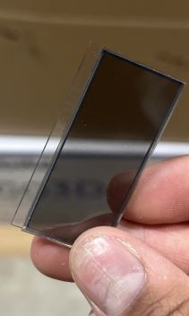
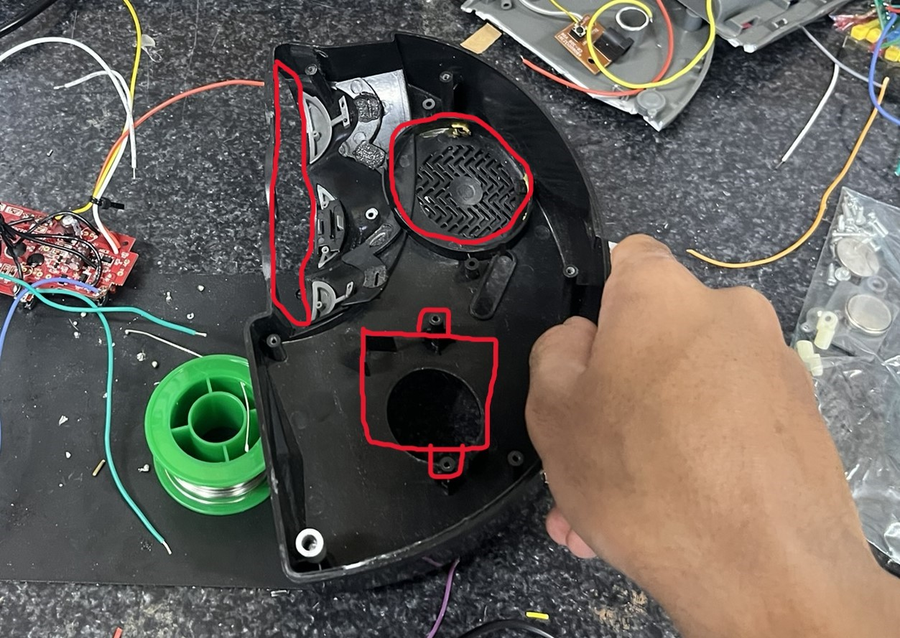

#  What is this?

  

This is a modified Lightning Mcqueen Alarm clock. It runs off a Pi Pico W. It's a sort of "smart" alarm clock. See before and after the modifications:
[insert images]
## Features
-	2.42" OLED display with automatic timeout
-	TMP117 for ambient room temp.
-	Headlights (Synced to ringtones)
-	DFPlayer for any MP3 ringtone
-	Wifi
	-	NTP Time
	-	Messaging System
	-	Controls smart device
-   Battery Backup
-   JSON storage in case clock dies

Note: for better cable management, I mounted the screen upside down. Thus, the display code assumes the origin in the bottom right corner, and has rotate=180 everywhere. (I didn't realize the library I was using can flip the display until it was too late)

#  Upgrades from original

- Membrane -> Tactile buttons

- Set any .mp3 file as ringtone

- Larger display

- LCD -> OLED

- Headlights

- Manual time setting -> NTP time

- Ambient temperature sensor

#  Server

  

###  About

  

A Linux server is used in conjunction with the alarm clock (files that run on the server are in the server folder of the repo). This server hosts the discord bot, a message cache, and an http server to toggle the lights and interact with the server cache.

  

###  Why?

  

The alarm clock runs on micropython. This cannot support a discord bot nor the python-kasa library used to control the smart switch. Furthermore, if the alarm clock’s webserver isn’t online, then someone cannot send a message. Thus, a server cache is used. A Pi Zero could be used, but that isn’t breadboard friendly (gpios are all on one side). In addition, the linux overhead makes timing less precise, so the headlights wouldn't be synced as well.

  

#  The original alarm clock

  

The orginal design had a pcb right behind the display and buttons that ran everything. There were only external wires for the batteries, motor, and speaker. I noticed these features

  

- Motor that can spin both ways, moving McQueen around (linearly)

- Transparent LCD display

- Buttons for control

- A switch to toggle the alarm

- Reset button

- Several power methods (Barrel jack, coin battery, 4xAA)

- Speaker

  

  

The alarm clock appeared to have a ton of space on the inside, but there are ‘pillars’ that connect the bottom of the alarm clock to the body, reducing the amount of space to work with. The motor also took up a lot of space. I didn't take a picture with all the original components, so drew them on. You can see where the PCB, motor, and speaker sit. Power methods sat on the bottom plate. 

  

  

###  General Construction

  

The original PCB was used to keep buttons and switches in place. I ran wires from the buttons/switch to the pico.

  

The display sits left of the original display and is mounted far away from the clock body to allow McQueen to ~~move around~~. 3 nuts are used on each screw: one right behind the display (to hold it in place), and 2 on either side of the clock body. Using two screws allowed me to adjust how far out the display sits from the clock body.

  

The Pico and DFplayer are connected to the breadboard with female socket headers (H-bridge was directly soldered), and the breadboard sits behind the motor, and is secured via the top and bottom of the clock body.

  

I added an NPN transistor between the DFplayer and the speaker, as I noticed some feedback noise when the speaker was idle.

  

The Powerboost, Li-ion battery, and the boost converter are hot glued to the bottom plate. 

  

Each headlight consists of two LEDs in series, so the voltage must be >7V. Resistors were chosen for 9V, however, because I wanted the motor to run on 9v. The headlights have 4 wires: Vin, GND, and a signal wire for the left and right headlights. An NPN transistor is used for each headlight to toggle them. The leads of the LEDs were used for positioning and the protoboard was hot-glued in. I drilled a hole in the clock body for better cable routing.

  

The usb cable (not shown) comes out of what used to be the barrel jack hole. I modified the hole to stay continuous until the bottom, to have enough room for the cable. This cable is used for power and programming.

  

[add  images  in  this  section]

  

#  Compromises

  

These are things I wanted to add, but I couldn't for some reason.

  

- Custom PCB: Too many measurements and unknowns (such as hole radius for the screws) to create an accurate PCB that would fit in the footprint of the clock. I also wasn’t sure if all the components (pico, h bridge, DFplayer) would fit into the clock if I mount it where the original pcb was.

- Sound effects buttons (the smaller top buttons on the left and right) are linked, which gives a signal from both if one is pressed. I’d have to break a trace, then check if that stopped the linking. I have no idea which trace does that.

- No original sound effects: caused by poor planning, I didn’t record the clock’s factory sound effects before adding my modifications.

- Hard to repair design: mitigated by female pin headers on the board, but many things are directly soldered to each other. I didn't have connectors until recently.

- Can’t easily add ringtones: I need to open the clock to access the SD card and add more ringtones. Sd extender didn’t work, and mounting DFplayer and cutting a slit was too much work, as that would require extra wiring, 3d prints, and plastic cutting.

- Motor: The extra space and wiring from the powerboost and boost converter made it difficult for everything to fit inside. The headlights wiring also made McQueen significantly harder to move around, due to tension in the cable.
#  Parts List

  

- SPI OLED (2.42” HiLetGo)

- DFPlayer

- L9110H

- PowerBoost 500C

- 1200mAh LiPo battery

- Pico WH

- Push buttons

- Speaker

- Solder breadboard

- Female pin headers

- NPN transistors

- White Leds x4 (high viewing angle)

- Boost converter (5 -> 9v)

- Resistors
#  Wiring:

  

See the Fritzing sketch. (Fritzing file is also in the repo) 

  

#  Kudos

  

Rdagger68 – Library for display and fonts, writeup example

  

Mannbro – Library for DFplayer

  

Jrullan – Library for Neotimer

  

Javl - https://javl.github.io/image2cpp/

  

DanielNStovell - Rotating Cube