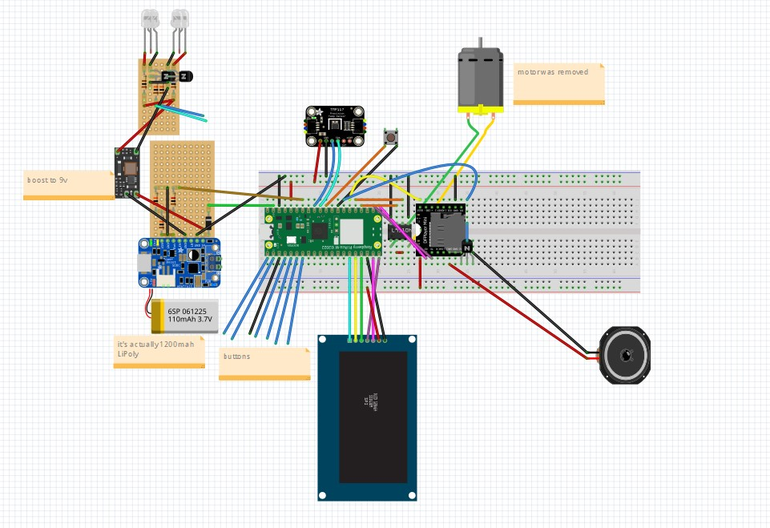

#  What is this?

  

This is a modified Lightning Mcqueen Alarm clock. It runs off a Pi Pico W. It's a sort of "smart" alarm clock. 

Original clock:

Note: for better cable management, I mounted the screen upside down. Thus, the display code assumes the origin in the bottom right corner, and has rotate=180 everywhere. (I didn't realize the library I was using can flip the display until it was too late)
## Features
-	2.42" OLED display with automatic timeout and diffrent states
    -   Home
    -   Set Alarm
    -   Message Viewer
    -   Display Off
-	TMP117 for ambient room temp.
-	Headlights (Synced to ringtones)
-	DFPlayer for any MP3 ringtone
-	Wifi
	-	NTP Time
	-	Messaging System
	-	Controls smart device
-   Battery Backup
-   JSON storage, retaining alarm time, messages, and ringtones upon reset/battery death


# Usage
While the code is made for this clock specifically, removing the headlights/motor portion of the code (or setting their pins to unused ones in config.py) will allow for an alarm clock with just a display, dfplayer/speaker, and buttons. There are only a some directories used by the clock in this repo (see uploading). 
You'll also need somewhere to run the discord bot in order for people to send messages to the clock. The clock can run without a server, but you lose the ability to send messages and caching, which allows for the clock to get messages even when offline (see Server section).


For music-synced LEDS, create a ``pulsepatterns`` dir on the pico. Upload pulsepatterns (created in audio dir) into that dir, naming them the index of the ringtone. To sync with 006.mp3, name it 6.json.

## Templates
alarm.json: quite straightforward. It is adjustable from the clock so you don't need to modify the file
motds.json: You may start with an empty list json '[]', then fill it up with the discord bot
-   Note: the 'time' key is currently not being used. It was intended to filter messages by how old they were, but I never coded that.
ringtones.json: Make sure this is synced with your DFplayer SD card. For example, if you have a Clash-Royale themed ringtone on 006.mp3 on the SD card:
```
{
    "index": 6,
    "description": "Clash Royale",
    "volume": 20
}
```
Volume is adjustable on the clock. Keep descriptions short so they are not cut off. When making the SD card, make a dir named ``01``, then sequentially number the ringtones. 
## Uploading
Use VScode with the micropico extension or mpremote. Upload the following:
-   .py files in the root dir
-   displaystates
-   hardware
-   lib
-   utils
-   alarm.json, motds.json, ringtones.json (upload into root dir)


#  Server

  

###  About

  

A Linux server is used in conjunction with the alarm clock (files that run on the server are in the server folder of the repo). This server hosts the discord bot, a message cache, and an http server to toggle the lights and interact with the server cache.

  

###  Why?

  

The alarm clock runs on micropython. This cannot support a discord bot nor the python-kasa library used to control the smart switch. Furthermore, if the alarm clock’s webserver isn’t online, then someone cannot send a message. Thus, a server cache is used. A Pi Zero could be used, but that isn’t breadboard friendly (gpios are all on one side). In addition, the linux overhead makes timing less precise, so the headlights wouldn't be synced as well.

  


#  Parts List

  

- SPI OLED (2.42” HiLetGo)

- DFPlayer

- L9110H

- PowerBoost 500C

- 1200mAh LiPo battery

- Pico WH

- Push buttons

- Speaker

- Solder breadboard

- Female pin headers

- NPN transistors

- White Leds x4 (high viewing angle)

- Boost converter (5 -> 9v)

- Resistors
#  Wiring:

  

See the Fritzing sketch. (Fritzing file is also in the repo) 

#  Upgrades from original

- Membrane -> Tactile buttons

- Set any .mp3 file as ringtone

- Larger display

- LCD -> OLED

- Headlights

- Manual time setting -> NTP time

- Ambient temperature sensor

# Build


#  Kudos

  

Rdagger68 – Library for display and fonts, writeup example

  

Mannbro – Library for DFplayer

  

Jrullan – Library for Neotimer

Javl - https://javl.github.io/image2cpp/