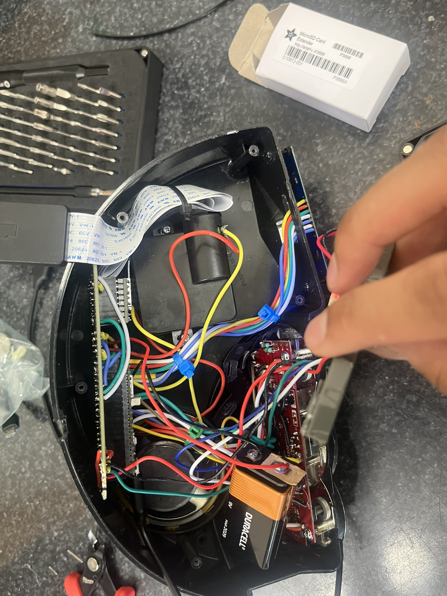
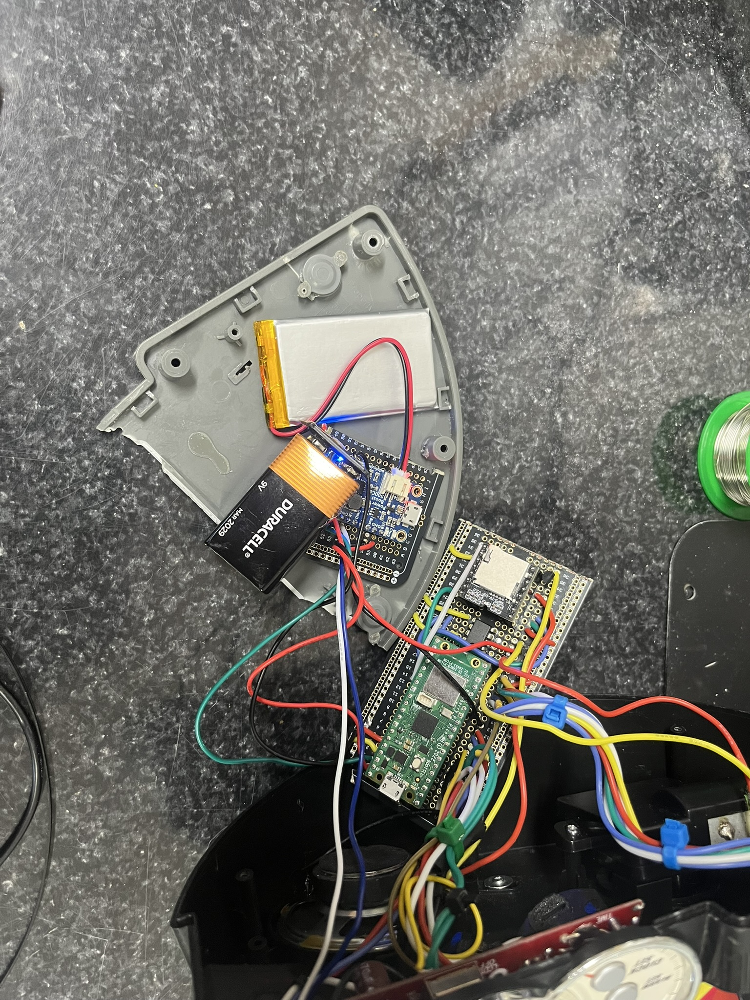

# Intro and motivation

This project modified this alarm clock, giving it a large oled display and Wi-Fi. The initial motivation for this project was to get myself into the world of microcontrollers and circuits, along with adding NTP time as this clock is quite old, and its timekeeping started to drift noticeably. Furthermore, this alarm clock is quite interesting, and I wanted to give it a new life with modern upgrades. 

# Features

-   NTP time with automatic daylights savings adjustment
-   Adjustable daily alarm
-   Toggleable alarm via switch
-   Smart switch control
-   Messaging system
-   Mp3 playback for alarms via SD card
-   Motor direction and speed control
    -   Sync McQueen to ringtone
-   Icons representing status (Wi-Fi, alarm, new message, on battery/power)

# Server

### About

A Linux server is used in conjunction with the alarm clock (files that run on the server are in the server folder of the repo). This server hosts the discord bot, a message cache, and an http server to toggle the lights and interact with the server cache.

### Why?

The alarm clock runs on micropython. This cannot support a discord bot nor the python-kasa library used to control the smart switch. Furthermore, if the alarm clock’s webserver isn’t online, then someone cannot send a message. Thus, a server cache is used. A Pi Zero could be used, but that isn’t breadboard friendly (gpios are all on one side).

# The alarm clock

In late March, I decided to open up the alarm clock to see what I was working with. The design had a pcb right behind the display and buttons. It connected to components like the motor with some wires. It had the following features:

-   Motor that can spin both ways, moving McQueen around (linearly)
-   Transparent display (not exactly sure what type of display it is)
-   Buttons for control
-   A switch to toggle the alarm
-   Reset button
-   Several power methods (Barrel jack, coin battery, 4xAA)
-   Speaker

The alarm clock appeared to have a ton of space on the inside, but there are ‘pillars’ that connect the bottom of the alarm clock to the body, reducing the amount of space to work with. The motor also took up a lot of space. I didn't take a picture with all the original components, so drew them on. You can see where the PCB, motor, and speaker sit. Power methods sat on the bottom plate. 

### Parts list with Justifications:

-   SPI oled (2.42” HiLetGo): oled displays look great and are self-illuminating. It was very appealing to me due to the sharp contrast, good viewing angles, and true blacks. I also did not need a colored display.
-   DFplayer: Very easy to wire and control.
-   L9110H: Small (8 pins) and comes with kickback diodes.
-   Powerboost 500c: Allows for clock to run primarily off of wall power, while giving uninterrupted switching to the battery in case wall power is absent.
-   1200mah battery: See current draw section. The current draw is mainly from the pico since all other components are off almost all the time. Based on the Pico’s current draw, and the available options at Adafruit, I went with 1200mah.
-   9V battery: Used to power the motor, giving it more speed as compared to the 6v in the original design.
-   Pico wh: Pre soldered pin headers allows me to use female sockets, so in case the board fails I can replace it easily. The pico W is quite fast and comes with Wi-Fi.
-   Motor: drives Mcqueen, came with the clock so screw mounting holes were already present.
-   Push Buttons: Replaced the membrane buttons, giving a much better feel.
-   Speaker: Came with the clock.
-   Solder breadboard: Faster to build compared to perf or stripboard. Easier to replicate breadboard design.
-   Female pin headers: In case the pico or other components go bad, I can switch them out easily.
-   NPN transistor: cuts power to speaker so there’s no idle feedback noise.

### Parts cost:

-   Display: \$20
-   Dfplayer(s): 10\$/5pc. = \$2/pc.
-   L9110H: \$1.50
-   Powerboost 500C: \$15
-   Battery (1200mah): \$10
-   9V battery: Idk
-   Pi pico WH: \$7
-   Motor: Came with clock = \$0
-   Push Buttons: \$5/100pc. = negligible
-   Speaker: Came with clock = \$0
-   Solder breadboard: \$9.50/3 = \$3.20
-   Female pin headers: \$6
-   NPN transistor: Really?
-   Total: \$84
-   Total by pc.: \$64.70

### 3d Printing

I was very against 3d printing stuff for this project. I don’t have much experience with 3d modeling, and I didn’t want to do multiple iterations in case I measured wrong and the part doesn’t fit.

### General Construction

The original PCB was used to keep buttons and switches in place. I ran wires from the buttons/switch to the pico.

The display sits left of the original display and is mounted far away from the clock body to allow McQueen to move around. 3 nuts are used on each screw: one right behind the display (to hold it in place), and 2 on either side of the clock body. Using two screws allowed me to adjust how far out the display sits from the clock body.

The Pico and DFplayer are soldered to the breadboard with female socket headers (H-bridge was directly soldered), and the breadboard sits behind the motor, and is secured via the top and bottom of the clock body, as well as the motor.

I added an NPN transistor between the DFplayer and the speaker, as I noticed some feedback noise when the speaker was idle.

The Powerboost and Li-ion battery are glued to the bottom plate. The 9V battery sits inside the clock but is not secured by anything.

The usb cable (not shown) comes out of what used to be the barrel jack hole. I modified the hole to stay continuous until the bottom, to have enough room for the cable. This cable is used for power and programming.

I couldn't get the SD extension to work with the DFplayer, so the final product omitted it. I also decided to glue the Powerboost directly to the bottom plate, rather than mount it on some breadboard.  

# Compromises

These are things I wanted to add, but I couldn't for some reason.

-   Headlights for McQueen via LEDs: I stripped the screw and could not continue without cutting plastic.
-   Custom PCB: Too many measurements and unknowns (such as hole radius for the screws) to create an accurate PCB that would fit in the footprint of the clock. I also wasn’t sure if all the components (pico, h bridge, DFplayer) would fit into the clock if I mount it where the original pcb was.
-   Sound effects buttons (the smaller top buttons on the left and right) are linked, which gives a signal from both if one is pressed. I’d have to break a trace, then check if that stopped the linking. I have no idea which trace does that.
-   No original sound effects: caused by poor planning, I didn’t record the clock’s factory sound effects before adding my modifications.
-   Hard to repair design: mitigated by female pin headers on the board, but many things are directly soldered to each other.
-   Can’t easily add ringtones: I need to open the clock to access the SD card and add more ringtones. Sd extender didn’t work, and mounting DFplayer and cutting a slit was too much work (wiring, 3d prints, and plastic cutting)

# Wiring:

See the fritzing sketch. (Fritzing file is also in the repo) The battery is actually 1200mAh, not 110. Buttons and switches not shown, but they were placed to the left of where the display wires are.

# Kudos

Rdagger68 – Library for display and fonts, writeup example

Mannbro – Library for DFplayer

Jrullan – Library for Neotimer

Javl - https://javl.github.io/image2cpp/

DanielNStovell - Rotating Cube
